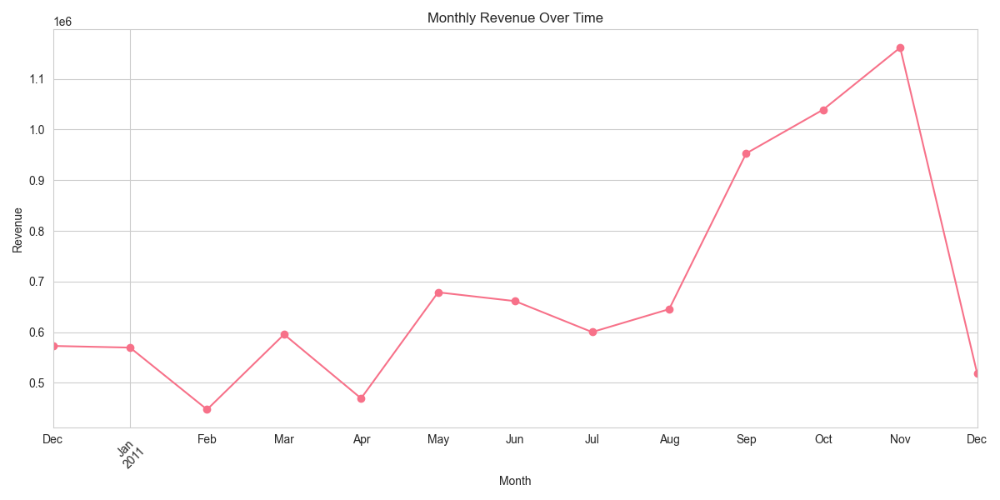
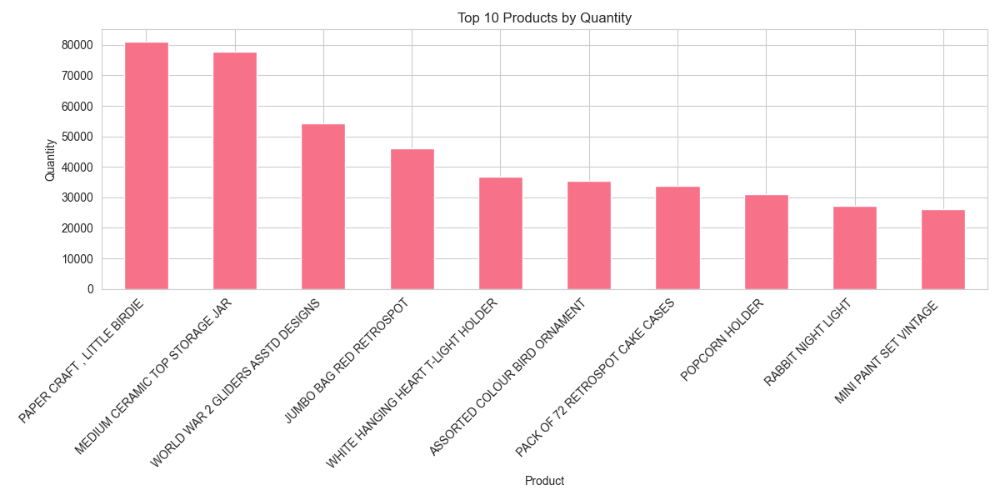
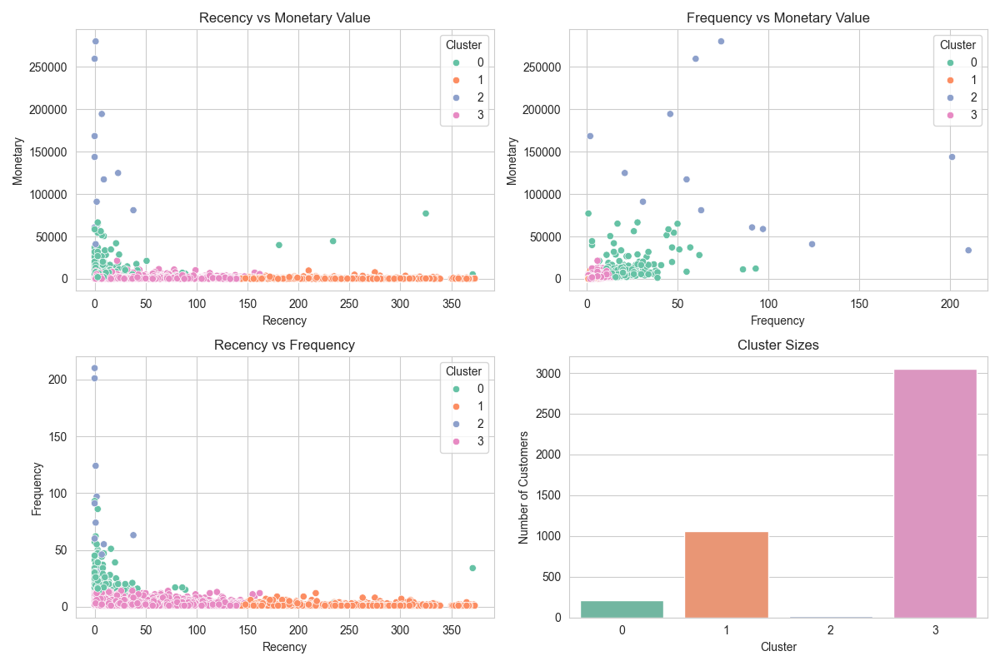
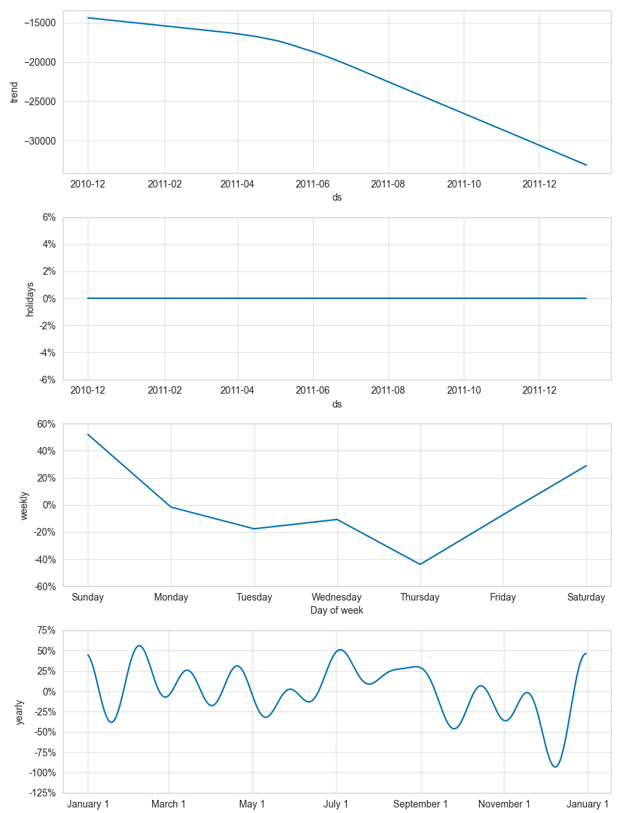
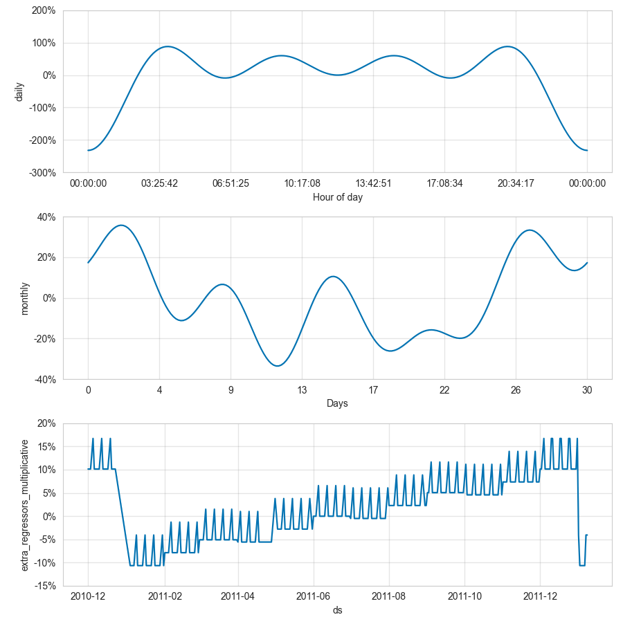
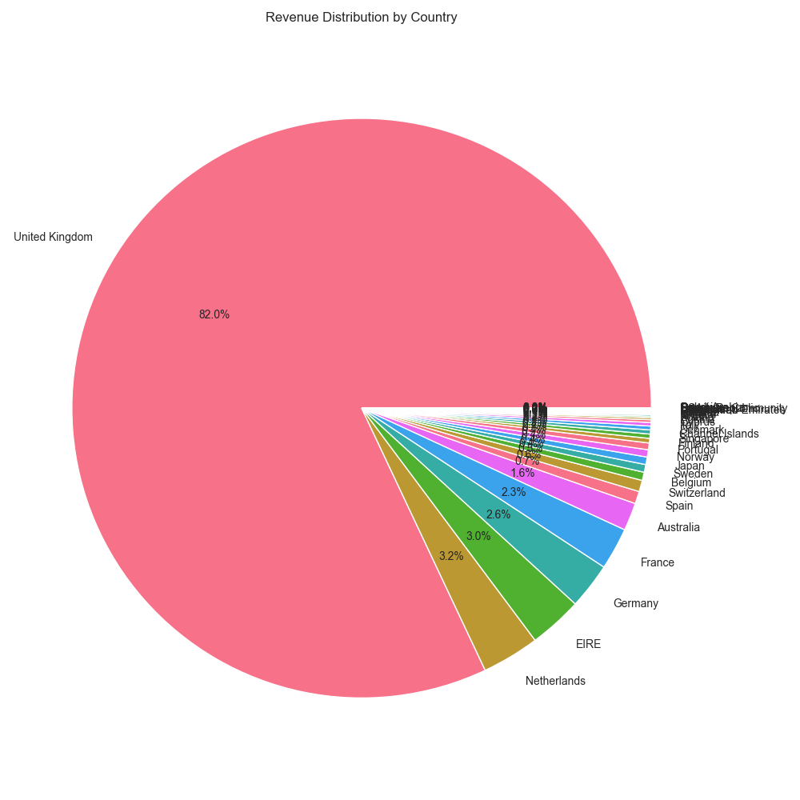
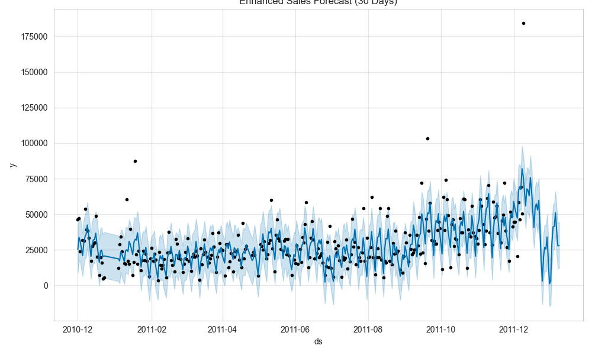
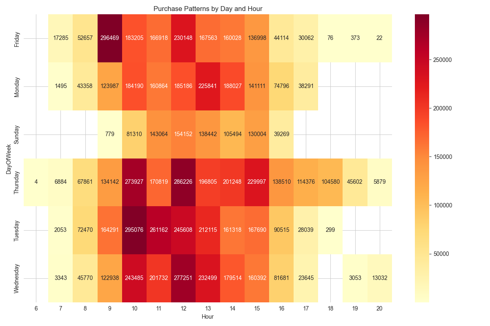

# 🌟 <h1>EcoInsight: Retail Analytics Dashboard</h1>

<div align="center">
  
  
</div>

## 📊 Overview

EcoInsight is a powerful retail analytics dashboard that transforms raw sales data into actionable insights, helping businesses optimize operations and boost revenue through data-driven decisions.

## ✨ Key Features

- 📈 Real-time revenue tracking and forecasting
- 🛍️ Customer segmentation and behavior analysis
- 📊 Interactive visualizations and dashboards
- 🔮 Advanced predictive analytics
- 🌍 Geographic sales analysis
- 📱 Responsive and modern UI

<div align="center">
  
  
  
</div>

## 🚀 Technology Stack

- **Backend**: Python, Flask
- **Data Analysis**: Pandas, NumPy
- **Machine Learning**: XGBoost, Prophet
- **Visualization**: Plotly
- **Frontend**: HTML, CSS, JavaScript
- **Deployment**: Render

<div align="center">
  
  
</div>

## 📈 Analytics Capabilities

- Revenue forecasting using advanced ML models
- Customer segmentation and RFM analysis
- Product performance tracking
- Geographic sales distribution
- Time series analysis and trend detection
- Anomaly detection in sales patterns

<div align="center">
  
</div>

## 🛠️ Installation

1. Clone the repository:
```bash
git clone https://github.com/yourusername/EcoInsight.git
```

2. Install dependencies:
```bash
pip install -r requirements.txt
```

3. Run the application:
```bash
python app.py
```

## 🔮 Future Enhancements

- Real-time data integration
- Advanced customer churn prediction
- Inventory optimization recommendations
- Custom report generation
- API integration capabilities

## 📝 License

This project is licensed under the MIT License - see the LICENSE file for details.

## 👥 Contributing

Contributions are welcome! Please feel free to submit a Pull Request.

---

<div align="center">
  <p>Made with ❤️ by Himanshu Singh</p>
</div> 